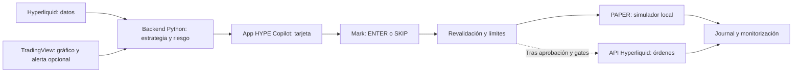

# Primera prueba de HYPE Copilot — objetivo de entrega en 24 horas

Propuesta operativa del 2026-09-09, no modificación de los gates de promoción del PRD. Mantener `LIVE_EXECUTION=false`.

Objetivo para esta noche: recorrido PAPER verificable de punta a punta. Una operación sintética/replay sirve para probar la mecánica y debe quedar identificada como tal; una operación de mercado solo se ofrece cuando aparece un candidato válido. No forzar un trade para cumplir el horario. Este plazo no permite acreditar rentabilidad ni sustituye semanas de PAPER/SHADOW.

## Reparto sugerido

- Claude: continuar implementación de backend, adaptador de datos, paper, persistencia y app mínima dentro de la arquitectura prevista. Un solo responsable de editar cada archivo.
- Codex: revisar diffs contra PRD, reproducir fallos, verificar tests e integración. Indicador visual preliminar aislado en `tradingview/hype_copilot_preview.pine`; no sustituye el v1 ni cambia los módulos de Claude.
- Mark: elegir PAPER/testnet, revisar la tarjeta y decidir ENTER/SKIP. La decisión de pasar a dinero real es separada; todavía no está tomada.

## Prioridad para el bloque de trabajo de esta noche

1. **Backend que arranca y tests que realmente se ejecutan.** Resolver imports antiguos y nuevos rotos. Python ya existe en `C:/Users/Mark/AppData/Roaming/uv/python/cpython-3.12.13-windows-x86_64-none/python.exe`; no perder tiempo reinstalándolo. Validar imports del motor, riesgo, settings y guardas, además de discovery.
2. **Cerrar fallos que invalidan una prueba:** clearance sin datos; LONG F2 sin VWAP; A+ incompleto; sizing/costos al fill; límites persistentes; protección que compruebe precio, lado, instrumento, cantidad y órdenes correctas. El guard nuevo inspeccionado comprueba existencia de TP pero aún no su precio y no vincula protección a la cantidad de posición: no basta para real.
3. **Camino vertical PAPER:** datos nativos Hyperliquid → motor Python → riesgo → guardar señal → tarjeta web → ENTER/SKIP → fill paper posterior a señal → SL/TP/time stop → journal. Incluir costos/funding explícitos y no inventar datos ausentes. Ante falta de datos, mostrar motivo del rechazo.
4. **Una pantalla funcional:** mercado y edad de datos; candidato con Entry/SL/TP/Size/Risk/Cost y vencimiento; botones ENTER/SKIP; posición paper y protecciones; historial. Usar el frontend Next.js y backend FastAPI ya previstos. SQLite local está permitido por el PRD. Analytics avanzadas y acabado visual pueden esperar.
5. **Ensayo completo:** señal válida de fixture/replay claramente marcada; ENTER duplicado; 91 s; drift 0.11R; segunda posición; segundo trade del día; medianoche; restart; costos altos; datos stale; SL/TP inválidos; 24 h con reloj simulado. El ensayo no espera 24 h reales para verificar el timer.

## Trabajo posterior dentro de la ventana de 24 horas

Poner el forward logger con datos reales, comprobar candidato Python contra TradingView, corregir diferencias y preparar testnet si se elige esa prueba. La disponibilidad de mercado, cuentas/testnet y resultados de tests condicionan la entrega; las horas son un objetivo, no una certificación automática.

PAPER y testnet cumplen propósitos distintos: PAPER comprueba la lógica y contabilidad; testnet añade firma/API/aceptación de órdenes simuladas del venue, sin demostrar fills de mainnet ni edge. Si se implementa testnet, separar explícitamente red, credenciales y autorización: nunca activar mainnet para probarlo. La ruta testnet no está implementada por esta propuesta.

## Verificación al preparar este plan

Se probaron imports sin enviar órdenes: `app.strategies.hype.engine`, `app.risk.sizing` y `app.core.config` importan correctamente. `app.risk.limits` y `app.execution.order_guard` fallan con `ModuleNotFoundError: app.indicators`. Causa: `risk/limits.py` importa `from ..indicators import session_start_ms`; el módulo compartido está en `app/strategies/indicators.py`. Cambio mínimo propuesto al responsable del archivo: `from ..strategies.indicators import session_start_ms`, seguido de repetir ambos imports y sus tests. No se editó ese archivo concurrente.

El discovery de unittest también sigue fallando por el nombre heredado `hype_long_vwap_retest`. Los controles locales del indicador solo revisaron formato, ausencia de marcadores de conflicto y ausencia de llamadas de órdenes; no son una compilación Pine ni una prueba de paridad. Ambos pendientes están documentados en `tradingview/PREVIEW_README.md`.

## Desde dónde se gestionará

La interfaz será nuestra app web HYPE Copilot. En desarrollo se prevé abrirla localmente en el navegador, con frontend y backend separados; aún no se ha levantado un servicio ni se garantiza un puerto concreto. El usuario no necesita operar desde el editor de código.

En modo real futuro, los fondos y posiciones estarán en la cuenta de Hyperliquid. El backend usará un adaptador de su API con una API wallet autorizada; la clave se guarda en el backend, nunca en Pine ni en el navegador. La app envía las instrucciones y verifica el estado real del exchange. TradingView no se convierte en intermediario de custodia ni fuente autorizada de órdenes.

Las protecciones SL/TP de real deben residir y verificarse en el venue; time stop, conciliación y alertas necesitan un proceso de backend activo. Cerrar el navegador no debe detener el backend. Para operar durante hasta 24 h, el equipo/servidor debe permanecer encendido y conectado.

Para PAPER local no hace falta exponer un webhook público: el scanner puede leer directamente Hyperliquid. TradingView opcionalmente envía HTTP POST a un endpoint accesible; un localhost del usuario no es accesible desde sus servidores. Posponer esa conexión no debe retrasar la primera prueba PAPER.

Referencias oficiales: [API y testnet de Hyperliquid](https://hyperliquid.gitbook.io/hyperliquid-docs/for-developers/api), [endpoint de órdenes](https://hyperliquid.gitbook.io/hyperliquid-docs/for-developers/api/exchange-endpoint), [webhooks de TradingView](https://www.tradingview.com/support/solutions/43000529348-how-to-configure-webhook-alerts/).
